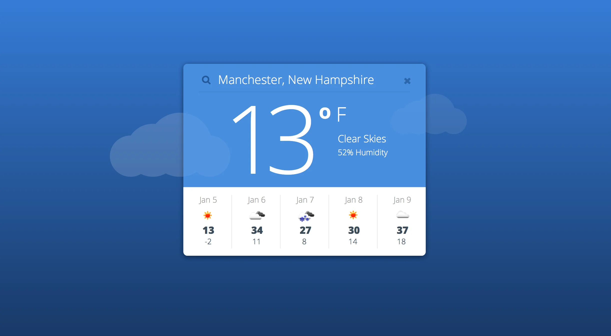
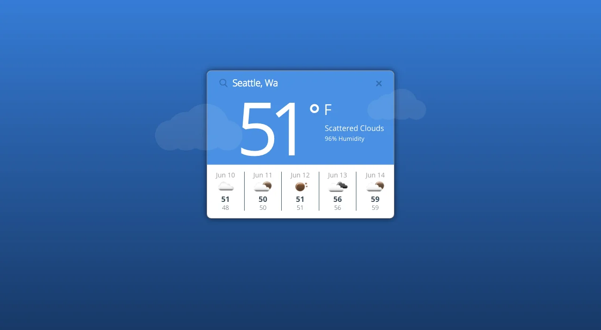

# Project : BBB Weather-App

Simple single page weather app. This was a UI challenge, I was given a photo and told to duplicate it as closely as possible. From a functionality stand point I leveraged cookies to improve latency and limit unnecessary requests. I also utilized navigator's geolocation to find the user's current location, if the user's browser does not have this functionality or the user declines to share their location, then I look up their IP address and use the address asscoiated with their IP.

## Goal

## Result

## Tech/Framework/Packages

- Node
- Heroku
- Github
- NPM/Yarn
- Frontend Node packages:
  - Compression
  - Dotenv
  - Express
  - Helmet
  - createreactapp
    - React
    - React-dom
  - React-redux
  - React-router
  - React-router-dom
  - Redux
  - Sass
  - Superagent
- devDependencies:
  - Eslint
  - Prettier
  - Redux-devtools-extension
  - Redux-logger

## How to use?

Clone this repo, cd into the cloned project folder, run `npm install`. From here create a .env file based on the .env-sample file and then run `npm run watch or yarn watch` and go to localhost:3000. From here type in a city ex. Seattle to get a 5 day forecast.

## Contribute

You can totally contribute to this project if you want. Fork the repo, make some cool changes and then submit a PR.

## License

MIT. Use it up!
